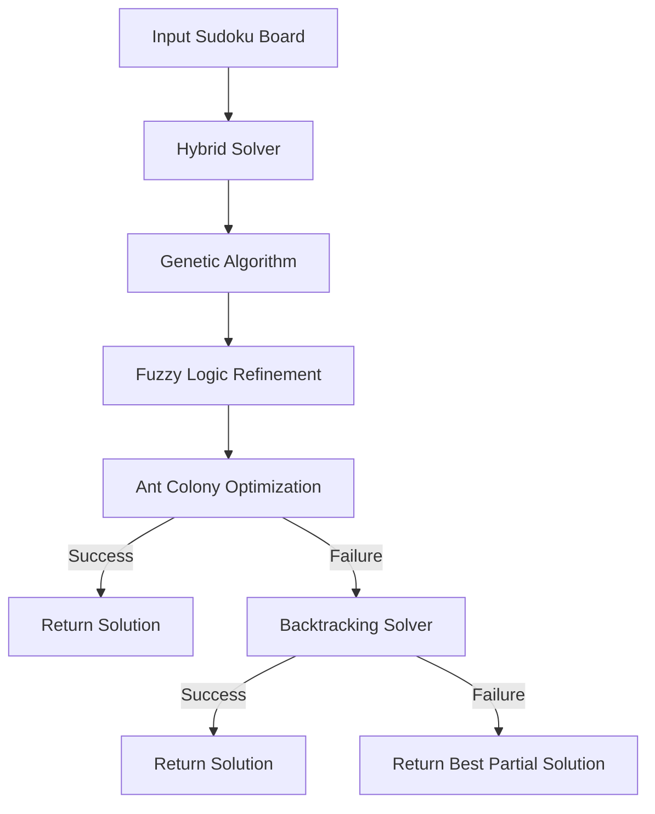
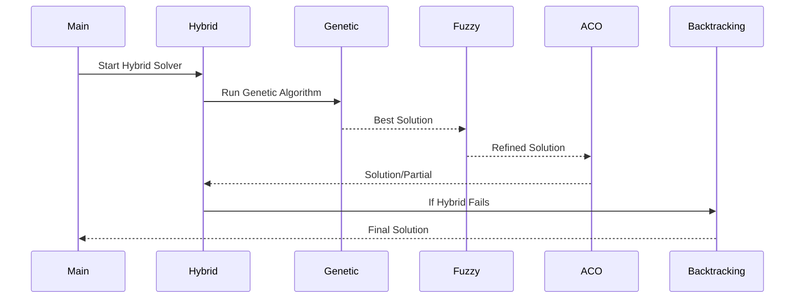
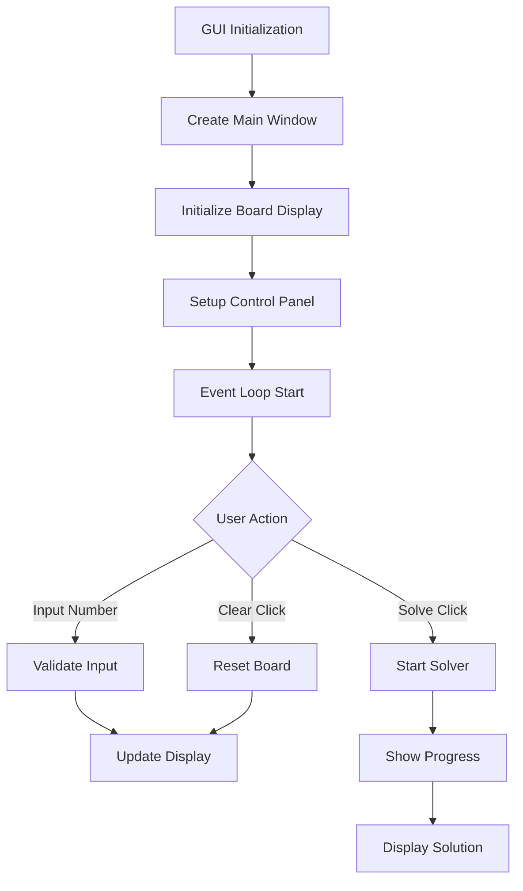

# Technical Documentation: Sudoku Solver Algorithms

## 1. Hybrid Algorithm Architecture



## 2. Algorithm Details

### 2.1 Genetic Algorithm (GA)

#### Core Components:
1. **Population Representation**
   - Each chromosome represents a complete Sudoku board
   - Population size: 500 individuals
   - Encoding: 9x9 grid as 81-digit string

2. **Fitness Function**
   ```
   Fitness = -Σ(violations)
   where violations = row_violations + column_violations + box_violations
   ```

3. **Genetic Operations**
   - **Crossover**: Two-point crossover with probability 0.7
   - **Mutation**: Random number swap with probability 0.3
   - **Selection**: Tournament selection with size 3

4. **Parameters**
   - Population Size: 500
   - Generations: 2000
   - Mutation Rate: 0.3
   - Crossover Rate: 0.7

### 2.2 Ant Colony Optimization (ACO)

#### Pheromone Model:
```
τ(i,j,k) = (1-ρ) * τ(i,j,k) + Σ(Δτ(i,j,k))
where:
- τ(i,j,k): Pheromone level for number k at position (i,j)
- ρ: Evaporation rate (0.1)
- Δτ(i,j,k): Pheromone deposit by ant
```

#### Probability Formula:
```
P(i,j,k) = [τ(i,j,k)^α * η(i,j,k)^β] / Σ[τ(i,j,k)^α * η(i,j,k)^β]
where:
- α: Pheromone importance (1.0)
- β: Heuristic importance (2.0)
- η(i,j,k): Heuristic value for number k at (i,j)
```

### 2.3 Fuzzy Logic System

#### Membership Functions:
1. **Number Possibility (NP)**
   ```
   μ_NP(x) = {
       1, if x is definitely possible
       0.5, if x is partially possible
       0, if x is impossible
   }
   ```

2. **Constraint Satisfaction (CS)**
   ```
   μ_CS(x) = {
       1, if all constraints satisfied
       0.7, if most constraints satisfied
       0.3, if some constraints satisfied
       0, if no constraints satisfied
   }
   ```

#### Fuzzy Rules:
```
IF (NP is HIGH) AND (CS is HIGH) THEN (Place_Number is CERTAIN)
IF (NP is MEDIUM) AND (CS is MEDIUM) THEN (Place_Number is POSSIBLE)
IF (NP is LOW) OR (CS is LOW) THEN (Place_Number is UNLIKELY)
```

### 2.4 Backtracking Algorithm

#### Search Space:
- Total possible states: 9^81
- Constraint propagation reduces search space

#### Algorithm Steps:
1. Find empty cell
2. Try numbers 1-9
3. Check constraints:
   - Row constraint: Σ(row) = 45
   - Column constraint: Σ(column) = 45
   - Box constraint: Σ(box) = 45
4. Backtrack if no valid number found

## 3. Hybrid Algorithm Integration

### 3.1 Parallel Processing
```
Time Complexity: O(n/p)
where:
- n: Total computation time
- p: Number of processes (default: 4)
```

### 3.2 Algorithm Flow


### 3.3 Performance Metrics
1. **Success Rate**
   ```
   Success Rate = (Successful Solutions / Total Attempts) * 100
   ```

2. **Average Solving Time**
   ```
   Avg Time = Σ(Solving Times) / Number of Puzzles
   ```

3. **Algorithm Efficiency**
   ```
   Efficiency = (Backtracking Success Rate + Hybrid Success Rate) / 2
   ```

## 4. Implementation Details

### 4.1 Data Structures
1. **Board Representation**
   ```python
   class SudokuBoard:
       def __init__(self, board_string):
           self.board = [[int(board_string[i*9 + j]) for j in range(9)] for i in range(9)]
   ```

2. **Population Structure (GA)**
   ```python
   class Population:
       def __init__(self, size):
           self.individuals = [SudokuBoard() for _ in range(size)]
   ```

### 4.2 Optimization Techniques
1. **Constraint Propagation**
   - Forward checking
   - Arc consistency
   - Naked pairs/triples

2. **Parallel Processing**
   - Multi-process implementation
   - Shared memory for results
   - Process pool management

## 6. GUI Implementation

### 6.1 Required Packages

import tkinter as tk
from tkinter import ttk
import customtkinter as ctk  # For modern UI elements
from PIL import Image, ImageTk  # For image handling

### 6.2 GUI Working Mechanism

#### 6.2.1 Core Components and Flow



#### 6.2.2 Board Display Implementation
1. **Grid Creation**
   - 9x9 matrix of Entry widgets
   - 3x3 sub-grids with distinct borders
   - Initial numbers in bold
   - User input cells in different color

2. **Input Handling**
   - Only numbers 1-9 allowed
   - Real-time validation
   - Auto-focus next cell
   - Error highlighting

3. **Visual Feedback**
   - Green highlight for correct numbers
   - Red highlight for conflicts
   - Blue highlight for current cell
   - Gray background for initial numbers

#### 6.2.3 Control Panel Functions
1. **Solve Button**
   - Triggers selected algorithm
   - Shows solving progress
   - Displays time taken
   - Handles solution display

2. **Clear Button**
   - Resets user inputs
   - Preserves initial numbers
   - Clears error highlights
   - Resets timer

3. **Load Puzzle**
   - Reads from JSON file
   - Validates puzzle format
   - Updates display
   - Resets solver state

#### 6.2.4 Algorithm Integration
1. **Solver Connection**
   ```python
   def solve_puzzle(self):
       # Get current board state
       board = self.get_board_state()
       
       # Start progress indicator
       self.show_progress()
       
       # Call selected solver
       solution = self.selected_solver.solve(board)
       
       # Update display with solution
       self.update_display(solution)
   ```

2. **Progress Display**
   - Progress bar for long operations
   - Step-by-step solving animation
   - Time elapsed counter
   - Algorithm status updates

#### 6.2.5 User Interaction Flow
1. **Input Process**
   ```
   User Input → Validation → Update Board → Check Conflicts → Update Display
   ```

2. **Solving Process**
   ```
   Solve Click → Algorithm Selection → Start Solver → Show Progress → Display Solution
   ```

3. **Error Handling**
   ```
   Error Detection → Show Error Message → Highlight Problem → Suggest Correction
   ```

#### 6.2.6 State Management
1. **Board State**
   - Current numbers
   - Initial numbers
   - User inputs
   - Error states

2. **Solver State**
   - Selected algorithm
   - Solving progress
   - Time elapsed
   - Solution status

#### 6.2.7 Performance Optimizations
1. **Display Updates**
   - Batch cell updates
   - Deferred rendering
   - Efficient redraw
   - Memory management

2. **Input Processing**
   - Debounced validation
   - Efficient event handling
   - Optimized state updates
   - Smart focus management

#### 6.2.8 Error Recovery
1. **Input Errors**
   - Invalid number entry
   - Conflict detection
   - Format validation
   - Recovery suggestions

2. **Solver Errors**
   - Timeout handling
   - Memory overflow
   - Invalid state recovery
   - User notification


